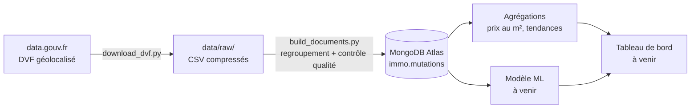

# Immo Pipeline : le marché immobilier des Alpes-Maritimes

Pipeline de données de bout en bout sur les transactions immobilières réelles du département des Alpes-Maritimes (06), de la collecte des données publiques jusqu'à l'analyse et la modélisation des prix.

> 🚧 **Projet en cours.** Étape 1 (collecte, modélisation MongoDB, contrôle qualité) terminée. Analyse, modélisation et tableau de bord à venir : voir la [feuille de route](#feuille-de-route).

## Objectifs

- Construire un pipeline **reproductible** : téléchargement, transformation et chargement automatisés.
- **Fiabiliser** des données publiques brutes, dont la structure piège la plupart des analyses naïves.
- Analyser les prix au m² par commune et leur évolution sur 5 ans.
- Modéliser le prix d'un logement et détecter les transactions atypiques.

## Stack technique

| Rôle | Outil |
|---|---|
| Langage | Python (pandas, requests) |
| Base de données | MongoDB Atlas (NoSQL documentaire), pymongo |
| Exploration | Jupyter Notebook |
| Versionnement | Git / GitHub |

## Architecture



- **Couche brute** : les fichiers sources sont conservés tels quels sur disque (`data/raw/`), jamais modifiés.
- **Couche propre** : une collection MongoDB où chaque vente est un document structuré et contrôlé.
- Le chargement est **idempotent** (upsert) : relancer le pipeline met à jour les documents sans créer de doublons.

## Source des données

**Demandes de Valeurs Foncières (DVF)** : ensemble des ventes immobilières enregistrées par la DGFiP, publié en open data. Version utilisée : **DVF géolocalisé** (Etalab), qui ajoute les coordonnées de chaque parcelle.

- Périmètre : Alpes-Maritimes (06), années **2021 à 2025**.
- Les données sont anonymes : ni acheteur ni vendeur.

## Pourquoi MongoDB ?

Dans le fichier DVF, **une vente est éclatée sur plusieurs lignes** : une par local (appartement, cave, parking) et par nature de terrain, avec le prix total répété sur chaque ligne.

Le modèle documentaire permet de reconstituer la vente telle qu'elle a eu lieu : **un document par vente**, avec des tableaux imbriqués pour les biens et les parcelles, sans jointure.

```json
{
  "_id": "2024-71069",
  "date_mutation": "2024-03-15",
  "nature_mutation": "Vente",
  "valeur_fonciere": 385000,
  "prix_m2": 6209.7,
  "adresse": { "voie": "...", "code_postal": "06000", "commune": "Nice" },
  "location": { "type": "Point", "coordinates": [7.26, 43.70] },
  "biens": [
    { "type_local": "Appartement", "surface_reelle_bati": 62, "nombre_pieces_principales": 3, "lots": ["12"] },
    { "type_local": "Dépendance", "lots": ["45"] }
  ],
  "parcelles": [],
  "qualite": { "flags": [], "eligible_modele": true }
}
```

Fonctionnalités MongoDB exploitées :
- **documents imbriqués** à la place des jointures ;
- **index géospatial `2dsphere`** : requêtes du type « toutes les ventes à moins de 300 m d'un point » ;
- **pipelines d'agrégation** pour les statistiques ;
- **schéma flexible** : les champs de terrain n'existent que pour les maisons.

## Contrôle qualité des données

L'exploration (`notebooks/01_exploration.ipynb`) a mis en évidence plusieurs pièges, chacun traité dans le pipeline.

**1. Une vente = plusieurs lignes.** En 2024, les dépendances (34 433 lignes) sont plus nombreuses que les appartements (20 941) : à Nice et sur le littoral, un appartement se vend le plus souvent avec une cave ou un parking. Calculer un prix au m² ligne par ligne, ou sommer les prix, fausse donc les résultats.

**2. Logements répétés.** Lorsqu'une parcelle a plusieurs natures de culture, le même logement apparaît sur plusieurs lignes (2 103 lignes concernées en 2024). Sans dédoublonnage, la surface est comptée deux fois et le prix au m² divisé par deux. La clé de dédoublonnage inclut la parcelle et l'adresse, pour ne pas fusionner deux biens réellement distincts de même surface.

**3. Divisions en volumes.** 60 ventes de 2024 ne comportent ni local ni parcelle décrite : ce sont exclusivement des divisions en volumes (ensembles immobiliers complexes). Au total, 82 ventes contiennent au moins un volume (dont 22 avec des locaux décrits). Leurs prix, de 1 € à 13 M€, ne sont pas comparables au marché résidentiel.

**4. Terrains non résidentiels.** Exemple réel à Tende : une « maison » de 30 m² vendue 151 500 € avec 40 parcelles (≈ 15 ha de forêts et de pâtures). Le prix au m² naïf donne **5 050 €/m²**, un niveau de centre-ville niçois, alors que la vente porte surtout sur des terrains. Ces ventes sont signalées et exclues du modèle.

### Indicateurs de qualité

Chaque document reçoit des indicateurs (`qualite.flags`). Une vente sans indicateur est éligible à la modélisation.

| Indicateur | Signification | Nombre (2021-2025) |
|---|---|---:|
| `sans_logement` | aucun appartement ni maison (parking, cave, local, terrain seul) | 48 511 |
| `terrain_non_residentiel` | forêts, landes, terres agricoles incluses dans la vente | 12 384 |
| `local_commercial` | présence d'un local commercial ou industriel | 8 829 |
| `plusieurs_logements` | plusieurs logements vendus en un seul acte | 6 259 |
| `sans_coordonnees` | position géographique manquante | 2 640 |
| `nature_hors_vente` | échange, adjudication, vente de terrain à bâtir | 1 589 |
| `prix_m2_hors_bornes` | prix au m² hors de [500 ; 50 000] € (ex. ventes à l'euro symbolique) | 973 |
| `division_en_volumes` | ensemble immobilier complexe | 536 |
| `prix_manquant` | valeur foncière absente ou nulle | 144 |

Une même vente peut porter plusieurs indicateurs.

## Optimisation du stockage

Dans MongoDB, le nom de chaque champ est stocké dans chaque document. Les champs vides (`null`) occupaient donc de la place 184 548 fois. Ils sont désormais supprimés avant l'insertion : un champ absent signifie « valeur inconnue », ce que le schéma flexible permet.

| | Taille de la base |
|---|---:|
| Avant | 261 Mo |
| Après | 170,4 Mo |
| **Gain** | **−35 %** |

Les requêtes restent inchangées : dans MongoDB, `{"prix_m2": null}` renvoie aussi les documents où le champ est absent.

## Premiers résultats

- **184 548 ventes** chargées dans MongoDB pour 2021-2025.
- **121 734 ventes (66 %)** retenues pour la modélisation.
- Le nombre de ventes a chuté de **26 % entre 2022 et 2024** (42 606 → 31 399), dans un contexte de hausse des taux d'intérêt, avant un rebond en 2025 (34 593).

| Année | Ventes |
|---|---:|
| 2021 | 40 476 |
| 2022 | 42 606 |
| 2023 | 35 474 |
| 2024 | 31 399 |
| 2025 | 34 593 |

## Structure du projet

```
immo-pipeline/
├── data/raw/                  # fichiers DVF bruts (non versionnés)
├── notebooks/
│   ├── 01_exploration.ipynb   # découverte des données et diagnostic qualité
│   └── 02_verification.ipynb  # contrôles après chargement
├── src/
│   ├── download_dvf.py        # téléchargement des fichiers DVF
│   └── build_documents.py     # construction des documents et chargement MongoDB
├── .env.example               # modèle de configuration
├── requirements.txt
└── README.md
```

## Installation et exécution

**Prérequis** : Python 3.10+ et un cluster MongoDB (Atlas gratuit ou local).

```bash
git clone <url-du-depot>
cd immo-pipeline

python -m venv .venv
.venv\Scripts\activate            # Windows
# source .venv/bin/activate       # macOS / Linux
python -m pip install -r requirements.txt
```

Copier `.env.example` en `.env` et renseigner la chaîne de connexion :

```
MONGODB_URI=mongodb+srv://<user>:<password>@<cluster>.mongodb.net/
```

Lancer le pipeline :

```bash
python src/download_dvf.py      # télécharge les fichiers 2021-2025 dans data/raw/
python src/build_documents.py   # construit et charge les documents dans immo.mutations
```

## Feuille de route

- [x] Collecte automatisée des données DVF
- [x] Modélisation documentaire et chargement dans MongoDB
- [x] Contrôle qualité et indicateurs de fiabilité
- [x] Optimisation du stockage (−35 %)
- [ ] Analyses par agrégation : prix au m² médian par commune et par année, communes en plus forte hausse
- [ ] Enrichissement : données INSEE (revenus, population), distance à la mer
- [ ] Modèle de prédiction du prix au m² (régression linéaire, puis modèles ensemblistes)
- [ ] Détection d'anomalies (Isolation Forest)
- [ ] Tableau de bord interactif (carte des prix, estimateur)
- [ ] Mise à jour automatique (GitHub Actions)

## Auteur

**Ivan Sinyavskiy** : étudiant en BUT Science des Données (3e année), IUT Côte d'Azur. En recherche d'alternance Data Analyst / Data Engineer.
LinkedIn : *à compléter*
